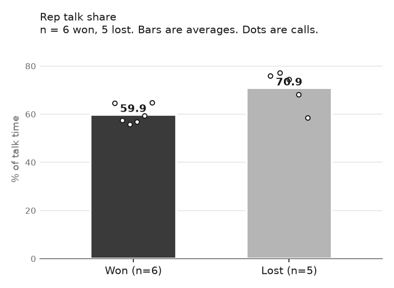

# AI Sales Coach

**Find out why you win deals and why you lose them, using your own sales calls.**

You record your calls. This tool listens to all of them, grades each one against your custom scorecard, and tells you in plain words what your winning calls did that your losing calls did not. Then it lets you practice against realistic, tough buyers until you improve.

Free and open source. Built by Luis ([@LuisPDoesAI](https://instagram.com/LuisPDoesAI)).

---

## What it tells you

Here is a real excerpt from the built-in demo (14 made-up calls):

> - Won calls tied the product to the prospect's own words. Lost calls walked through the platform.
> - Lost calls had the rep talking more: 70.88% of talk time against 59.87% on won calls.
> - The one skill for the next 5 calls: before showing anything, get the prospect to describe the problem and what it costs, then show only the part that fixes it.



Every call also gets a report card:

- **A score for each skill**, like finding the pain, handling objections, and holding your price.
- **Proof for every score.** Each score quotes the exact words you said. If there is no quote, there is no score.
- **Your weakest moment, rewritten** the way it should have sounded.
- **The one thing to change** on your next call.

---

## How it works (The method)

AI Sales Coach combines deterministic code with AI judgment so you get facts, not hallucinations:

1. **You drop in your call recordings.** Audio files from Zoom, Google Meet, Teams, Fathom, or your phone dialer.
2. **Deterministic code measures the facts.** The tool transcribes the call, separates you from the buyer, and measures exact numbers: your talk ratio, question counts, and how long you stayed silent after stating your price.
3. **AI grades each call against your scorecard.** Claude grades your skills, requiring word-for-word quotes from the transcript as proof for every score.
4. **Win vs. loss comparison.** Code crunches the numbers across all your calls and compares your wins to your losses.
5. **Interactive dashboard.** Open one local webpage to review your findings, charts, scorecards, email histories, and full transcripts.

---

## What you need

You only need three free or standard tools:

1. **Python** (version 3.10 or newer): runs the background scripts and math. [Download it here](https://www.python.org/downloads/).
2. **Claude Code**: the AI assistant that runs in your terminal and grades your calls. [Get it here](https://claude.com/product/claude-code).
3. **Google AI key**: free to start, converts your call audio into text. [Get one here](https://aistudio.google.com/).

---

## One-time setup

Open your **Terminal** app (on a Mac, press Cmd + Space and type "Terminal"; on Windows, open PowerShell). Copy and paste these lines one at a time, pressing Enter after each:

```bash
git clone https://github.com/luispdoesai/SalesCoach.git
cd SalesCoach
python3 -m venv .venv
source .venv/bin/activate
python -m pip install -r requirements.txt
python coach.py init
```

*Note for Windows users:* use `python` instead of `python3`, and `.venv\Scripts\activate` instead of the `source` line.

Next, open the `.env` file created in your `SalesCoach` folder and paste your Google key:

```
GEMINI_API_KEY=paste-your-key-here
```

Check that everything is set up correctly:

```bash
python coach.py doctor
```

### Try the 2-minute demo first (no key needed)

Want to see the dashboard with synthetic sample calls before using your own?

```bash
python coach.py demo
```

Then double-click **`Open-Dashboard.html`** in the project folder (or run `python coach.py dashboard --open`). That is what your own results will look like.

---

## How to use it on your calls

Sales Coach is driven by Claude Code and a few simple terminal commands.

To start, open your terminal inside the `SalesCoach` folder and launch Claude Code:

```bash
claude
```

Follow these steps:

### Step 1: Build your scorecard

Claude interviews you about how you sell (your deal size, sales cycle, who you talk to, and common objections) and builds your custom rubric in `rubric/rubric.md`.

- **Command in Claude Code:** `/coach-rubric`
- **Or paste this prompt:**
  ```
  Read CLAUDE.md and prompts/01_build_rubric.md. Interview me about how I sell, then write my sales rubric.
  ```

Answer its questions. Review the draft behaviors it suggests, tell it what to tweak or cut, and it will save your scorecard.

### Step 2: Add your calls and outcomes

1. Drop your audio or video recordings into the `data/inbox/` folder.
   Name them with the date, buyer initials, and call stage, for example:
   `2026-09-28_JD_Discovery.m4a`
2. Open `data/outcomes.csv` and mark each call as `won`, `lost`, `stalled`, or `open`. (You can also add deal value and notes).
3. (Optional) Add buyer contact info to `data/contacts.csv`.

### Step 3: Transcribe your calls

In your terminal, run:

```bash
python coach.py transcribe
```

This turns your audio into text, works out who the sales rep is, and notes tone shifts. Once finished, audio files are safely moved to `data/processed/`.

### Step 4: Add email context (optional)

If you use Gmail or have exported emails, this step reads past emails with the buyer and attaches a timeline to the call.

- **Command in Claude Code:** `/coach-emails`
- **Or paste this prompt:**
  ```
  Read prompts/03_email_context.md and pull email context for my calls. Read-only.
  ```

### Step 5: Grade your calls

Claude reads each transcript, matches it against your rubric, and writes a detailed scorecard JSON in `data/scorecards/`. Every score requires an exact verbatim quote from the transcript as proof.

- **Command in Claude Code:** `/coach-score`
- **Or paste this prompt:**
  ```
  Read prompts/04_score_call.md and score my calls against my rubric.
  ```

### Step 6: Crunch the numbers

In your terminal, run:

```bash
python coach.py analyze
```

This command verifies every quote against the audio timestamps, calculates your talk ratios and silence metrics, compares wins against losses, and creates your charts.

### Step 7: Generate your findings report

Claude analyzes the numbers and writes `Findings.md`, highlighting what your winning calls did differently, where lost deals turned, and the single skill to focus on for your next 5 calls.

- **Command in Claude Code:** `/coach-findings`
- **Or paste this prompt:**
  ```
  Read prompts/05_findings.md and write Findings.md from the latest analysis.
  ```

### Step 8: View your dashboard

Double-click **`Open-Dashboard.html`** in your project folder, or run:

```bash
python coach.py dashboard --open
```

Your browser opens an interactive dashboard that shows your findings, won vs. lost charts, and every call's scores, quotes, and full transcript.

### Step 9: Practice against tough buyers

Drill your weakest skills against realistic simulated buyer personas (such as a skeptical CFO or price shopper).

- **Command in Claude Code:** `/coach-practice`
- **Or paste this prompt:**
  ```
  Read prompts/06_roleplay.md and run a practice session with a buyer persona.
  ```

---

## Quick command cheat sheet

| Task | What to run or type | Where |
|---|---|---|
| Start Claude Code | `claude` | Terminal |
| Build scorecard | `/coach-rubric` | Claude Code |
| Transcribe audio | `python coach.py transcribe` | Terminal |
| Add email context | `/coach-emails` | Claude Code |
| Grade calls | `/coach-score` | Claude Code |
| Calculate stats | `python coach.py analyze` | Terminal |
| Write findings | `/coach-findings` | Claude Code |
| View dashboard | Double-click `Open-Dashboard.html` | Browser |
| Practice roleplay | `/coach-practice` | Claude Code |

When you get new calls, just drop them into `data/inbox/` and repeat steps 3 through 7. Finished calls are automatically skipped.

---

## Your privacy

- **Get consent to record.** Many places require everyone on the call to agree. Say it at the start of the call.
- **Check your company's rules** before using any AI tool on customer calls.
- **Know where your data goes.** Audio is sent to Google to turn it into text, then deleted from Google's storage. Claude reads the text to grade it. Check the data terms for your Google and Claude plans.
- **Your calls stay on your computer.** Your recordings, transcripts, key, and scorecard are never uploaded to GitHub. This project is set up to block that.
- **Gmail is read-only.** It never sends, drafts, labels, or deletes anything.

This is not legal advice.

## Keep it honest

- **Every score needs proof.** The tool checks that each quote really appears in the call. Made-up quotes are rejected.
- **The numbers come from code, not AI guesses.** Talk time, questions asked, and silence after your price are measured from the recording's timestamps.
- **Small samples can mislead.** You need at least 5 wins and 5 losses before comparisons mean much. Under 30 calls, treat patterns as hints.
- **Read a few report cards yourself.** If a score feels wrong, look at the quote.

---

## More help

- **[The full guide](docs/GUIDE.md)**: every command, where files live, what each number means, customizing, archiving old calls, and troubleshooting.
- **[Data formats](docs/DATA_FORMATS.md)**: the exact file formats, for anyone changing the code.
- **Found a bug?** Open a GitHub issue. Never paste real call data.

## Contributing

Pull requests are welcome. Run `pytest` first (it works offline, no keys needed). Never commit real call data.

## License

MIT. Free to use, change, and share.
